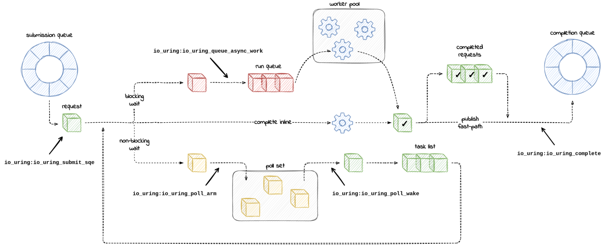
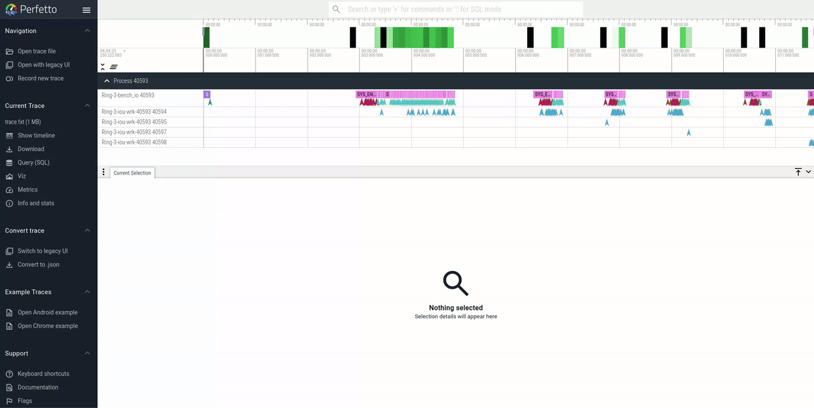

# uring-trace
Low impact tracing tool for visualizing workloads under
Linux's asynchronous IO-uring runtime. This tracer leverages eBPF
probes ([`ocaml_libbpf`](https://github.com/koonwen/ocaml_libbpf)) to
extract information from the kernel. Traces are generated in fuchsia
format to be displayed on [Perfetto](https://ui.perfetto.dev/).

### The Mental Model (taken from this [blog](https://blog.cloudflare.com/missing-manuals-io_uring-worker-pool))



### Example trace



### Motivation

The current best way to gain some observability into io-uring is to
use `perf` to sample your program. Whilst this works, it can be hard
to get a mental picture of how your program flows since perf reports a
linear history of the tracepoints it managed to collect. Our tool on
the other hand, traces requests as they go through io-uring
and provide an idiomatic way to understand how your IO-requests are handled as they go
through the kernel. Under the hood, this tracer uses eBPF technology to hook into
kernel tracepoints. Unlike perf, it is much more versatile to be extended to
hook into arbritrary points in the kernel to support future
enhancements to tracing.

  Visualization features:

- Path of IO requests from submission to completion
- Syscall time slices
- Kernel spawned IO-worker's tracks
- Multiple rings support
- Sampling option to handle high-throughput workloads

## Path of IO request from submission to completion

The io-uring runtime makes several decisions on how your request
should be processed asynchronously. In particular, there are 3
pathways that can happen in the `io_issue_sqe` kernel call:

1. Inline completion (fast path): If the IO request can be carried
   out immediately and does not need to wait, (i.e. the network
   interface has pending data), `io_issue_sqe` will directly process
   the request and return the result onto the completion queue.

2. Poll arming (slow path): For operations that are unable to start
   immediately but have non-blocking support, `io_issue_sqe` will add
   them to a poll set (register them for notification when they are
   ready to be consumed). When they are ready, they are processed and
   added to the completion ring

3. Async worker pool (slow path): For operations that are unable to
   start immediately and do not have non-blockin support,
   `io_issue_sqe` adds them to a pool of kernel io-workers that picks
   up the requests and gets blocked on them until they complete. This
   allows multiple blocking requests to complete asynchronously by
   having multiple io-workers handling each one.

This feature allows users to visualize the path a request takes in the
kernel. The lifetime of a request starts from a submission into the
SQring to a completion on the CQring. When you click on a request,
perfetto will draw arrows to show the path of an request. It also
shows linked requests to show the ordering expected by the program and
also ideally when the request is finally reaped by the users program.

## Syscall time slices

From the users perspective, io-uring is a performance win because
users can reduce the number of syscalls their program uses and
thereby - the overhead of context switch from user to kernel
modes. One way to see if your program is really benefitting from this
is to visualize the syscalls made.

You could use `strace` tool to get the numbers but that adds overhead
to your running program. This tool shows syscalls in the form of
timeslices so that you can see how much time your code spends from the
point of entry to exit of your syscall. This may provide more
information on how to tune your program.

## IO-worker tracks

io-uring internally uses something like a kernel workqueue to run your
IO request asynchronously. It's not obvious how many workers are
involved in processing the request and what worker might be blocked
for a long time. This tool shows each spawned io-worker as a track and
the uring instance it is associated to. The io-worker display's when
it picked up a completion for an io operation.

## Multiple uring instance support

Programs may intentionally use multiple rings. This tool supports
indicates the ring context of each request to enable filtering for
rings of interest.

# Current support

- [-] Path of IO request from submission to completion
  - [X] Tracepoint visualisation support set
    - [X] tracepoint:io_uring:io_uring_complete
    - [X] tracepoint:io_uring:io_uring_cqe_overflow
    - [X] tracepoint:io_uring:io_uring_cqring_wait
    - [X] tracepoint:io_uring:io_uring_create
    - [X] tracepoint:io_uring:io_uring_defer
    - [X] tracepoint:io_uring:io_uring_fail_link
    - [X] tracepoint:io_uring:io_uring_file_get
    - [X] tracepoint:io_uring:io_uring_link
    - [X] tracepoint:io_uring:io_uring_local_work_run
    - [X] tracepoint:io_uring:io_uring_poll_arm
    - [X] tracepoint:io_uring:io_uring_queue_async_work
    - [X] tracepoint:io_uring:io_uring_register
    - [X] tracepoint:io_uring:io_uring_req_failed
    - [X] tracepoint:io_uring:io_uring_short_write
    - [X] tracepoint:io_uring:io_uring_submit_req (previously, tracepoint:io_uring:io_uring_submit_sqe on older kernels)
    - [X] tracepoint:io_uring:io_uring_task_add
    - [X] tracepoint:io_uring:io_uring_task_work_run

  - [ ] Trace flow when event flags set IO-uring SQE link to see user enforced ordering of events.
  - [ ] We probably want to trace when the user picks up the completion so that we can see the ring filling/freeing up

- [X] Syscall track
  - [X] io_uring_setup
  - [X] io_uring_register
  - [X] io_uring_enter

- [X] IO-worker tracks
  - [X] Show number of io-workers
  - [X] Connected with flows

# Usage
To trace a program, you will first need to run the `uring\_trace`
binary in a separate process. The `uring\_trace` will detect when a
new uring instance is spawned and record events from there.

```bash
git clone git@github.com:koonwen/uring-trace.git
cd uring-trace
opam switch create . --deps-only -y
opam switch pin conf-liburing.opam . -y
cd uring-trace/src
make run

# In a separate terminal
<execute your program>
```

Once you've finished tracing/would like to stop tracing, hit `Ctrl-C`
and you should find a `trace.fxt` file in the same directory as
uring-trace/src which you can load into perfetto to explore what
io-uring was doing under the hood.

# Undesirable Behaviours
This tool reads events through a shared ring buffer with the kernel. As such
there is a possibility that events are overwritten before they are read and processed
when tracing busy workloads. This can result in trace visualizations with missing
events that look strange. To workaround this, the tracing tool has a sampling parameter
that can be tuned to trace only a percentage of the requests coming in.

# Discussion

Tracing vs Profiling

- The opaque and asynchronous nature of the uring runtime motivates
  tracing to give a picture of a programs execution to visualize where
  bottlenecks could be.
- Currently, it seems that the only way to get data from bpf programs
  is through a shared ring buffer, this is prone to overflows and lost
  events for high-throughput workloads.
- One solution would be to do sampling instead of full-blown tracing
  but this is fairly involved as we will need our program to implement
  some kind of rate limitting of requests so that flows can be
  properly recorded.
  - Per event ring buffer and global hashmap to filter seen req?
