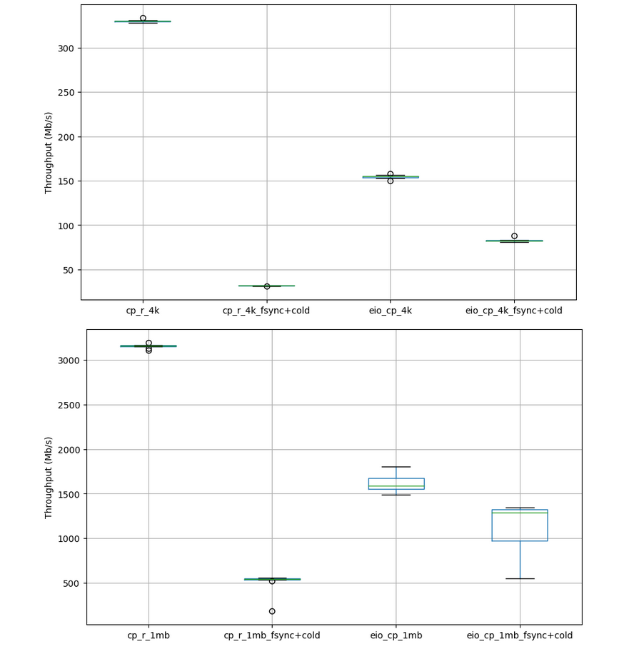
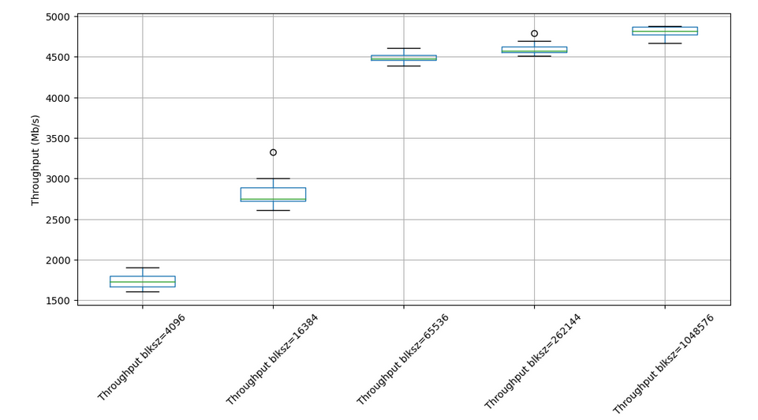
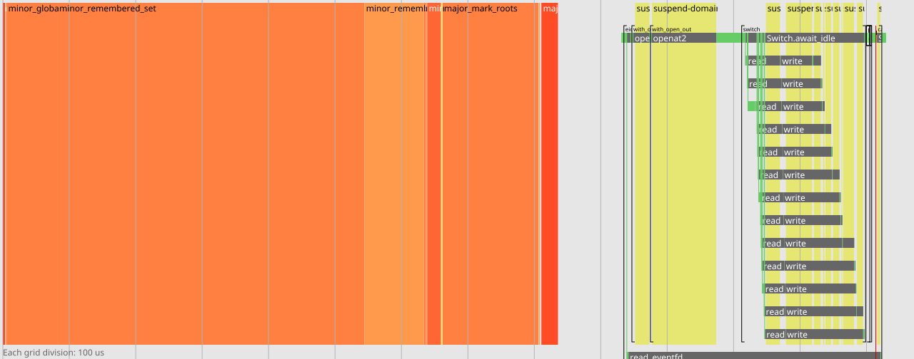

# TLDR
- The existence of the linux kernel page cache makes sequential
  storage IO already the most performant in terms of
  throughput. However, the structure of some complex programs can
  introduce high overheads from many small reads/writes to
  storage. Carefully applied async IO can improve performance here but
  is quite involved. Writing programs using eio can provide the best
  of both worlds by having two easy rules of thumb. If your program
  does a few but large IO requests, increase the default block size
  config. If your program has many small IO requests to disk, abuse
  concurrency and have the underlying scheduler handle your request
  batching for you. The two are not mutually exclusive and if
  possible, increase both of them. Or you can rely on the high-level
  flow API's to handle the concurrency for you.

# Introduction
The performance of disk IO under Linux is typically quite reasonable
because of kernel support for buffering requests. Adding asynchronous
IO naively can cause regressions in performance because it often ends
up duplicating the work already done by the page cache. As such
sequential IO is for disk is typically the most performant.

There are some scenarios where async IO can end up being better than
sequential IO. For example, the structure of some programs inherently
introduce significant overhead because of frequent context switching
from high syscall usage. IO-uring async interface tries to solve this
by providing a way to batch submissions of requests to the
kernel. However, structuring/restructuring programs to do explicit
batching is cumbersome and complex.

eio makes batching implicit and easy to express with the underlying
scheduler. Users can write high-level concurrent code and
transparently get syscall batching for free.

# Findings
- Asynchronous execution on storage IO is not generally a good target
  since these files are always "ready" to be consumed and work can
  always be done without waiting. Punting these request to an
  asynchronous context would just hurt overall throughput.

> In some sense, kernel buffering upgrades IO on disk files to just
> read/writes to main memory which are efficiently batched and
> dispathed to storage device later on

- The times when async execution is useful over the "blocking" semantics is only if you are
  1) Writing to separate disks
  2) Using O_DIRECT & keep an internal cache
  3) Don't have a lot of RAM (Your writes end up being blocked because of flushing the page cache)
  4) Need write durability
  5) Need good latency (Cannot be blocked on long read/writes)

- Otherwise, the linux buffering mechanism is a good default to have.
  To improve this further, we can look into reducing context switching
  into the kernel. The two mechanisms to do that are to:
  1) simply "elongate" rw by increasing block sizes. It reduces syscall usage when read/write
     large files and additionally reduces how often we get into the slow
	 io-uring path (write requests on regular files are always punted to
	 async worker... only XFS supports inline completion)
  2) increase the "depth" of your rw requests so they can be submitted
     at the same time to
     uring. [PR](https://github.com/ocaml-multicore/eio/pull/748)
     makes this a default setting in `Flow.copy`.


## Definitions
**IOPS**: Number of operations per second (!! Says nothing about the size of these operations)
**IO size**: The per request size of an operation
**Throughput**: IOPS x IO size
**Latency**: Time taken to complete a single operation
**Workload request percentage**: The breakdown of number of Reads/Writes/Deletions for a particular workload

**IO batching**: File IO is batched/buffered by the kernel as an
optimization. The kernel implicitly performs readahead optimization to
saturate the read requests so that they can already make it into the
page cache before being requested. Writes are also saturated because
the kernel buffers them to be flushed at a later time.

**Syscall batching**: Using io-uring to batch syscall requests to the
kernel, requiring only 1 context switch

> Disk performance expectations is highly variable depending on
> workload, see this link for a good breakdown on performance metrics
> for SSD's [SSD speed
> measurement](https://ssd.userbenchmark.com/Faq/What-is-the-effective-SSD-speed-index/42)

# Disk Benchmarks

## User benchmarks (2171 samples) for my SSD  INTEL (SSDPEKKF512G7L)
1QD Seq Read: 782Mb/s
1QD Seq Write: 519Mb/s
1QD Seq Mixed: 585Mb/s

1QD Random 4k Read: 29.1Mb/s
1QD Random 4k Write: 107Mb/s
1QD Random 4k Mixed: 42.8Mb/s

64QD Random 4k Read: 479Mb/s
64QD Random 4k Write: 463Mb/s
64QD Random 4k Mixed: 425Mb/s

[My results](bench.results)

## Evaluation
Best performance of raw IO against SSD hinges being able to saturate
disk.  The saturation point is reached when requests hit the maximum
IO size which is equivalent to (maximum sector size) and then start to
form a queue of pending requests. Sequential IO hits this case since
it is just streaming a while block of IO requests to disk. The 1QD
Random 4k read doesn't happen because of IO buffering by the kernel.

Copying one or a few **small/big** file(s): The most efficient way is
to just perform a sequential read and write with the maximum block
size. Even better, on Linux, we use copy\_file\_range API which
performs an in-kernel copy of the entire file with a single
syscall. Even if there are multiple files, the program is still
IO-bound since CPU work (syscall overhead) in contrast to IO is small
& negligible.

Copying **many small/large files**: With many files and directories,
the workload fundamentally changes from being totally IO-bound to
start experiencing pressure from context switching since it's doing
much more syscalls during traversal. Batched requests under IO-uring
can help minimize this cost with batch submission of syscalls.

In general, to handle both of these cases well, we can use the two
mechanisms mentioned above to improve performance.

## Appendix
Comparing underlying linux syscalls 1) read/write 2) splice 3)
sendfile 4) copy\_file\_range 

Comparing filesystem `cp -r` vs `eio\_cp -r`
```ocaml
open Eio

let ( / ) = Eio.Path.( / )

let copy_dfs concurrent src dst =
  let rec aux ~src ~dst =
    let stat = Path.stat ~follow:false src in
    match stat.kind with
    | `Directory ->
        Path.mkdir ~perm:stat.perm dst;
        let files = Path.read_dir src in
        let iter =
          if concurrent then Fiber.List.iter ~max_fibers:2 else List.iter
        in
        iter
          (fun basename -> aux ~src:(src / basename) ~dst:(dst / basename))
          files
    | `Regular_file ->
        Path.with_open_in src @@ fun source ->
        Path.with_open_out ~create:(`Exclusive stat.perm) dst @@ fun sink ->
        Flow.copy source sink
    | _ -> failwith "Not sure how to handle kind"
  in
  aux ~src ~dst

module Q = Eio_utils.Lf_queue

let copy_bfs src dst =
  let sem = Semaphore.make 64 in
  let q = Q.create () in
  Q.push q (src, dst);

  Switch.run @@ fun sw ->
  while not (Q.is_empty q) do
    match Q.pop q with
    | None -> failwith "None in queue"
    | Some (src_path, dst_path) -> (
        let stat = Path.stat ~follow:false src_path in
        match stat.kind with
        | `Directory ->
            Path.mkdir ~perm:stat.perm dst_path;
            let files = Path.read_dir src_path in
            (* Append files in found directory *)
            List.iter (fun f -> Q.push q (src_path / f, dst_path / f)) files
        | `Regular_file ->
            Semaphore.acquire sem;
            Fiber.fork ~sw (fun () ->
                Path.with_open_in src_path @@ fun source ->
                Path.with_open_out ~create:(`Exclusive stat.perm) dst_path
                @@ fun sink -> Flow.copy source sink);
            Semaphore.release sem
        | _ -> failwith "Not sure how to handle kind")
  done

let () =
  let block_size = try Some (int_of_string Sys.argv.(3)) with _ -> None in
  let concurrent = try bool_of_string Sys.argv.(4) with _ -> true in
  Eio_linux.run ?block_size (fun env ->
      let cwd = Eio.Stdenv.fs env in
      let src = cwd / Sys.argv.(1) in
      let dst = cwd / Sys.argv.(2) in
      copy_bfs src dst)
```


Varying block sizes


Using eio with uring batching in mind [implementation](https://github.com/ocaml-multicore/eio/blob/main/lib_eio_linux/tests/eurcp_lib.ml)


```
#OLD
+default_fs: 288.79 MB/s
{
  "config": {
    "uname": "Linux debian-thinkpad 6.1.0-23-amd64 #1 SMP PREEMPT_DYNAMIC Debian 6.1.99-1 (2024-07-15) x86_64 GNU/Linux",
    "backend": "linux",
    "recommended_domain_count": 4
  },
  "results": [
    {
      "name": "Flow.copy",
      "metrics": [
        {
          "name": "default_fs",
          "value": 302819851.7110036,
          "units": "bytes/s",
          "description": "default_fs Flow.copy"
        }
      ]
    }
  ]
}

#NEW
+default_fs: 462.35 MB/s
{
  "config": {
    "uname": "Linux debian-thinkpad 6.1.0-23-amd64 #1 SMP PREEMPT_DYNAMIC Debian 6.1.99-1 (2024-07-15) x86_64 GNU/Linux",
    "backend": "linux",
    "recommended_domain_count": 4
  },
  "results": [
    {
      "name": "Flow.copy",
      "metrics": [
        {
          "name": "default_fs",
          "value": 484808364.3907238,
          "units": "bytes/s",
          "description": "default_fs Flow.copy"
        }
      ]
    }
  ]
}
```

# Other Notes
## Lifting IO batching into userspace.
High performance storage IO solutions typically suggest using async IO
with O\_DIRECT flag on files to skip the kernel page cache and write
their own internal caching mechanism instead. Essentially this _lifts_
the IO batching responsibility into user space. This is a rather
involved design but eio could potentially support this.
